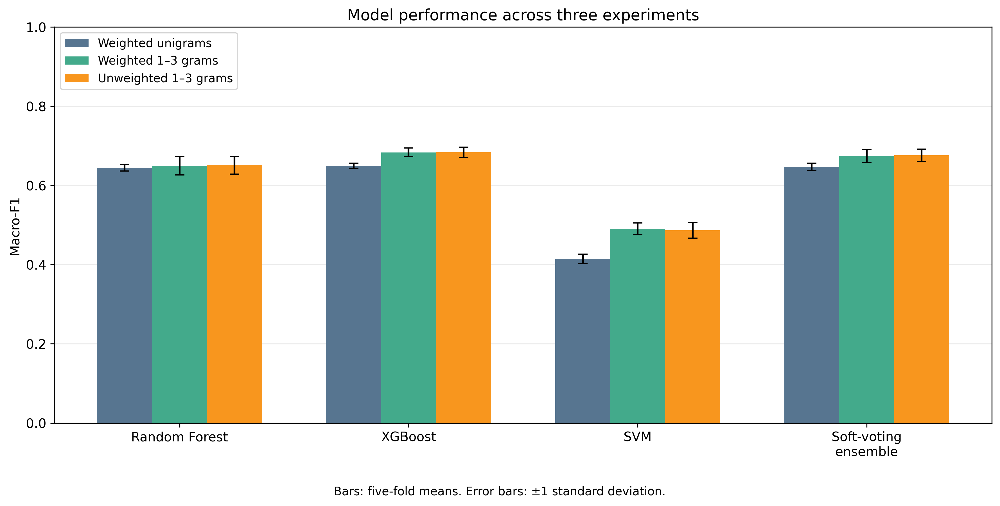
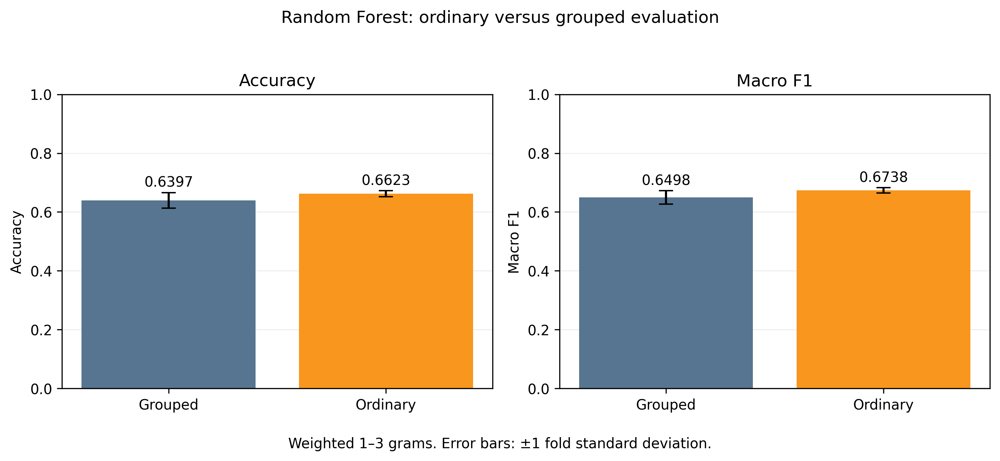
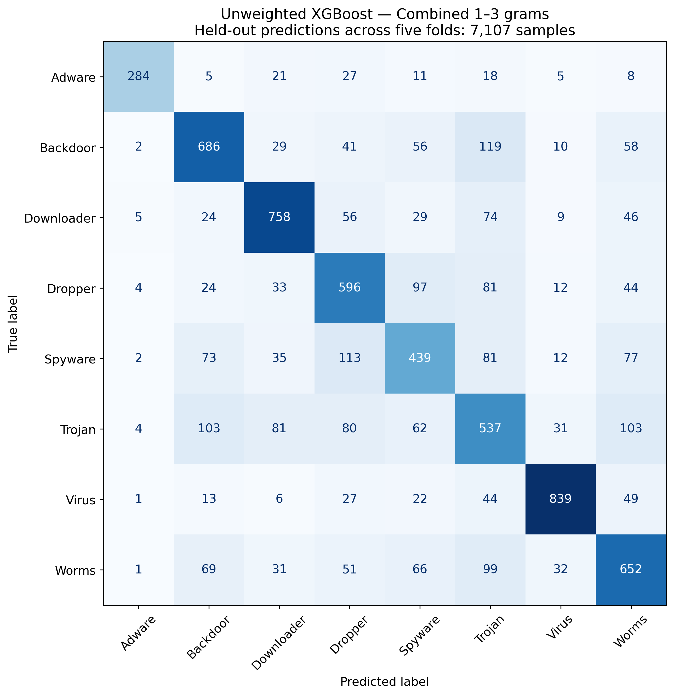

# Duplicate-Aware Evaluation of API N-Gram Malware Classification

A course project evaluating **eight malware categories** in Mal-API-2019 using TF-IDF API n-grams, Random Forest, XGBoost, SVM, and equal-probability soft voting.

**Team — Group 16, United International University**

- Md. Shohan Mia — 0112230037
- Md. Asif Sarkar — 0112230921

[Experiment notebook](notebooks/MalAPI_Corrected_Experiment.ipynb) · [Open in Colab](https://colab.research.google.com/github/Asif78980/malapi-duplicate-aware-evaluation/blob/main/notebooks/MalAPI_Corrected_Experiment.ipynb) · [Original Colab](https://colab.research.google.com/drive/15LGubBMgX0g2SrTR0kcktygGyAW1ZC4v?usp=sharing) · [Presentation](presentation/MalAPI_Final_Presentation.pptx)

## Objectives

1. Audit exact duplicate API sequences and prevent their overlap between training and testing.
2. Compare Random Forest, XGBoost, SVM and soft voting under the same grouped five-fold protocol.
3. Compare weighted unigrams with weighted combined 1–3 grams, and weighted with unweighted combined 1–3 grams.
4. Compare ordinary and grouped five-fold evaluation for Random Forest and measure exact-sequence overlap.

## Dataset and scope

Dataset source: [Catak and colleagues' repository](https://github.com/ocatak/lstm_malware_detection) and [dataset description](https://arxiv.org/abs/1905.01999).

| Category | Samples |
|---|---:|
| Trojan | 1,001 |
| Backdoor | 1,001 |
| Downloader | 1,001 |
| Worms | 1,001 |
| Virus | 1,001 |
| Dropper | 891 |
| Spyware | 832 |
| Adware | 379 |

The evaluated copy contains 7,107 samples and 6,518 unique full sequences: 589 additional copies across 290 repeated-sequence groups. There are 33 identical-sequence groups with conflicting labels. All samples and supplied labels were retained.

This dataset contains malware only. Our task is **multiclass malware-category classification**, not malware-versus-benign detection. It has no metamorphic-engine labels, so these experiments do not establish metamorphic robustness. Labels such as Trojan and Backdoor are broad categories rather than specific malware lineages.

## Methodology

- Read the headerless labels correctly and retain every API-call field, including single-digit IDs.
- Use full sequences without truncation, despite the input filename `1000_calls.csv`.
- Hash whitespace-normalized full sequences with SHA-256 to assign duplicate groups. Hashes are used for splitting only, not as model features.
- Use `StratifiedGroupKFold(n_splits=5, shuffle=True, random_state=42)`; every sample is tested once and no identical-sequence group crosses a train/test boundary.
- Fit TF-IDF separately on each training fold. Tokenization uses `str.split`, `token_pattern=None`, and `lowercase=False`; `min_df=2`, `max_features=50000`, float32, default L2 normalization and smoothed IDF.
- Compare weighted unigrams, weighted combined 1–3 grams, and unweighted combined 1–3 grams on the same saved grouped folds.
- Report accuracy and macro precision, recall and F1 as five-fold means with sample standard deviations. Macro scores give each category equal weight.

| Model | Main settings |
|---|---|
| Random Forest | 300 trees; random state 42; balanced class weights in weighted experiments |
| XGBoost | 300 estimators; depth 6; learning rate 0.1; subsample/column sample 0.8; histogram tree method; multiclass probabilities; balanced training sample weights in weighted experiments |
| SVM | Linear kernel; C=1; probability estimates enabled; balanced class weights in weighted experiments |
| Soft voting | Equal average of class-aligned RF, XGBoost and SVM probabilities |
| Baseline | Predict the most frequent category in each training fold |

## Results

Values below are proportions; multiply by 100 for percentages. ± indicates standard deviation across five folds, not a confidence interval.

### Weighted combined 1–3 grams: grouped evaluation

| Model | Accuracy | Macro F1 |
|---|---:|---:|
| Most-common-class baseline | 0.1272 ± 0.0078 | 0.0282 ± 0.0015 |
| Random Forest | 0.6397 ± 0.0265 | 0.6498 ± 0.0231 |
| XGBoost | 0.6733 ± 0.0151 | 0.6836 ± 0.0113 |
| SVM | 0.4754 ± 0.0176 | 0.4902 ± 0.0149 |
| Soft Voting Ensemble | 0.6657 ± 0.0207 | 0.6744 ± 0.0164 |

### Feature and weighting comparisons

| Model | Weighted unigram macro F1 | Weighted 1–3 gram macro F1 | Unweighted 1–3 gram macro F1 |
|---|---:|---:|---:|
| Random Forest | 0.6452 | 0.6498 | 0.6511 |
| XGBoost | 0.6500 | 0.6836 | 0.6837 |
| SVM | 0.4145 | 0.4902 | 0.4866 |
| Soft Voting Ensemble | 0.6472 | 0.6744 | 0.6761 |

XGBoost has the highest mean macro F1 in all three configurations. Combined n-grams have higher observed mean macro F1 than weighted unigrams for all four models. Class weighting has mixed and small observed effects. Equal soft voting does not outperform XGBoost in these experiments. These descriptive comparisons do not establish statistical significance.

### Ordinary versus grouped Random Forest

Same weighted combined 1–3 gram RF settings; ordinary splitting uses shuffled `StratifiedKFold` with five folds and random state 42.

| Protocol | Accuracy | Macro F1 | Held-out samples whose identical sequence occurs in training |
|---|---:|---:|---:|
| Grouped | 0.6397 ± 0.0265 | 0.6498 ± 0.0231 | 0 / 7,107 (0%) |
| Ordinary | 0.6623 ± 0.0105 | 0.6738 ± 0.0093 | 788 / 7,107 (11.09%) |

Ordinary evaluation has approximately **2.26 percentage points higher accuracy** and **2.40 percentage points higher macro F1**. This demonstrates sensitivity to evaluation protocol. The test partitions and their class compositions also differ, so the entire score difference cannot be attributed causally to duplicate overlap. This comparison was run for Random Forest only.

Confusion-matrix counts pool out-of-fold predictions for unweighted 1–3 gram XGBoost. Rows are actual labels and columns predicted labels. Per-category CSV scores are fold means and can differ from scores calculated from pooled counts.

## Repository contents

- `notebooks/`: recorded Colab experiment with original code and saved outputs, plus navigation headings.
- `results/grouped/`: original five-fold score tables for all three configurations and recorded experiment settings.
- `results/ordinary_vs_grouped_rf/`: protocol comparison, overlap audit, class distribution and graph.
- `results/MalAPI_Complete_Results.zip`: detailed saved results, fold assignments, available predictions/probabilities, timing and figures. This is a results archive, not the dataset or trained model checkpoint.
- `figures/`: PNG/PDF plots and underlying comparison tables.
- `presentation/`: final presentation, including the ordinary-versus-grouped RF graph.

## How to inspect or rerun

**To inspect the work, no training is needed.** Read this README, open the notebook's saved outputs, and browse the CSVs and figures.

The notebook preserves the actual multi-session Colab workflow. It is not yet a single-command pipeline. Do not click **Run all** without adapting the saved-result paths: its first experiment creates a timestamped folder, while later sessions explicitly restore `20260919_182045`.

### Prepare Colab

1. Open the notebook using the Colab link above and save a copy in your Drive.
2. Obtain the dataset from the linked source. The loader expects a ZIP containing `1000_calls.csv` and the headerless `labels.csv`. Put that ZIP in Google Drive; the initial search expects a filename beginning `mal-api-2019`.
3. Inspect the discovered ZIP list and set `selected_file_number` to the correct entry before extraction. Later restore cells also contain the original ZIP filename; update it to yours.
4. Install dependencies if necessary with `%pip install -r /path/to/requirements.txt`. The recorded scikit-learn version is 1.6.1; other package versions were not captured and exact cross-environment replication is not guaranteed. Colab provides `google.colab`. Restart the runtime if changing an already-imported scikit-learn version, then rerun imports.

### Inspect saved results or regenerate plots

Download `results/MalAPI_Complete_Results.zip` using GitHub's download button and extract its contents into:

`MyDrive/MalAPI_Corrected_Results/20260919_182045/`

`fold_assignments.csv` and `experiment_settings.json` must be directly inside that folder. Section C generates tables and figures from the saved results without training. The archive does not contain the raw API sequences or fitted estimators.

### Rerun training

- **Section A (original code cells 0–24):** load and audit data, create grouped folds, train the weighted 1–3 gram models and save results. Note the new timestamped output directory.
- **Section B (original code cells 25–39):** replace the old results-directory path with that new directory, restore the exact dataset/folds, then run weighted unigrams and unweighted 1–3 grams.
- **Section C (original code cells 40–45):** point to the same directory to regenerate figures.
- **Section D (original code cells 46–54):** update the dataset ZIP and result-directory paths, restore the data, verify the saved manifest and scikit-learn version, then run ordinary RF and compare with the saved grouped RF results.

Section headings were added for navigation; original code cells and saved outputs were retained. Full retraining can take hours depending on runtime resources. Some cells reuse saved files, so use a fresh result directory if changing model settings to avoid mixing old and new results.

## Contribution and limitations

The contribution is a controlled empirical evaluation with an exact-duplicate audit, saved grouped folds, feature/weighting ablations and a measured ordinary-versus-grouped RF comparison. We do **not** claim a new algorithm, the first application of ensembles to Mal-API-2019, or verified global novelty.

- One malware-only dataset; no benign detection or metamorphic-engine evaluation.
- Exact duplicates are controlled; near-duplicates and related variants may remain across folds.
- Conflicting-label groups are retained as supplied.
- No independent final holdout, temporal split, or statistical-significance claim.
- Ordinary-versus-grouped results change both overlap and partitions; only RF was compared.
- SVM's internal probability calibration is not group-aware, although the outer held-out fold is excluded from training.
- Broad category labels, imbalance, and very long sequences limit interpretation and runtime efficiency.
- Notebook resume paths require manual adaptation; the full original dependency environment was not recorded.
- Published results under other preprocessing/split protocols are not direct head-to-head baselines.

## Possible extensions

1. **Completed:** ordinary-versus-grouped RF evaluation and overlap audit.
2. Examine errors for overlapping versus previously unseen sequences, especially Trojan and Spyware (descriptive analysis).
3. Recompute evaluation metrics excluding the 33 conflicting-label groups as a sensitivity check while keeping the full-data results primary.
4. Evaluate a small RF parameter search with inner grouped validation and training-only TF-IDF inside each outer training fold.
5. Explore RF+XGBoost equal soft voting using saved class-aligned probabilities; treat this post-hoc comparison as exploratory and validate independently before claiming improvement.

## Related work and dataset references

These studies provide context; their reported scores should not be compared directly without matching datasets, splits and preprocessing.

1. Catak and Yazi (2019). *A Benchmark API Call Dataset for Windows PE Malware Classification.* [arXiv:1905.01999](https://arxiv.org/abs/1905.01999).
2. Catak, Yazi, Elezaj and Ahmed (2020). *Deep learning based Sequential model for malware analysis using Windows exe API Calls.* [PeerJ Computer Science 6:e285](https://doi.org/10.7717/peerj-cs.285).
3. Demirkiran, Cayir, Unal and Dag (2022 version). *An Ensemble of Pre-trained Transformer Models For Imbalanced Multiclass Malware Classification.* [arXiv:2112.13236](https://arxiv.org/abs/2112.13236).
4. Li, Zhu, Liu, Song and Cheng (2024). *Comprehensive evaluation of Mal-API-2019 dataset by machine learning in malware detection.* [arXiv:2403.02232](https://arxiv.org/abs/2403.02232).
5. Panda, Bisoyi, Panigrahy and Mohanty (2025). *Machine learning techniques for imbalanced multiclass malware classification through adaptive feature selection.* [PeerJ Computer Science e2752](https://doi.org/10.7717/peerj-cs.2752).
6. Bisoyi, Panda, Patra and Mishra (2025). *An Ensemble technique for imbalanced multiclass malware classification by leveraging API call semantics.* [DOI:10.1007/s10791-025-09615-0](https://doi.org/10.1007/s10791-025-09615-0).

The dataset is not redistributed here. Follow the original source's usage terms. No license is assigned to third-party data or papers by this repository.
